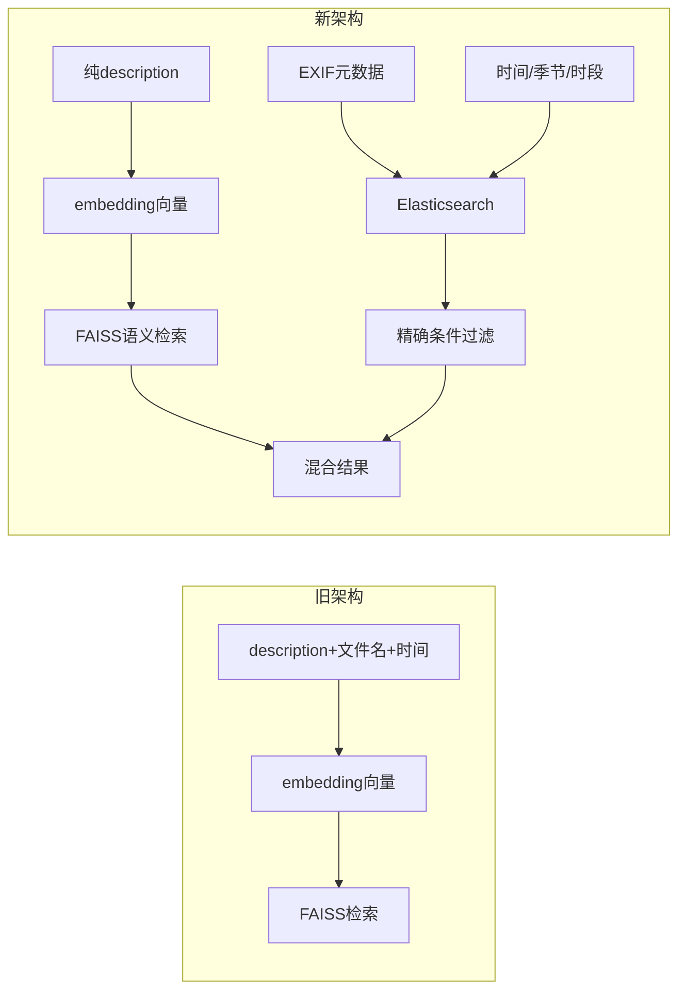
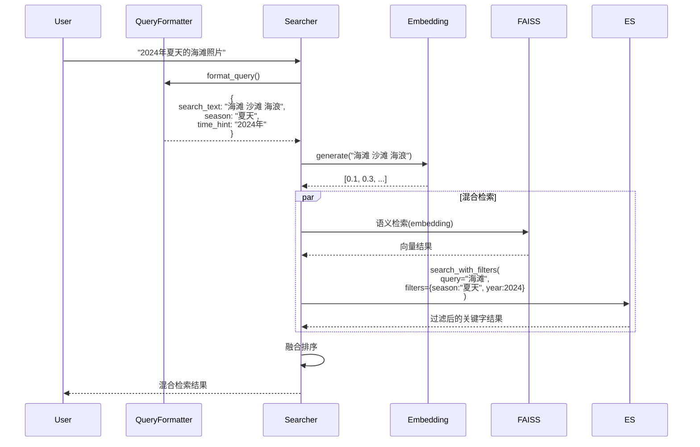

# Prompt 改写与接口对齐方案

## 一、架构理解总结

当前架构的核心改进（参考上一轮重构）：



### 关键约束

1. **Embedding 纯语义化**：`search_text` 只包含纯描述，不混入时间/文件名
2. **EXIF 独立过滤**：year/month/season/time_period 通过 ES 精确过滤
3. **7档时段细分**：凌晨/早晨/上午/中午/下午/傍晚/夜晚

## 二、核心问题分析

### 问题 1：QueryFormatter 的 `search_text` 拼接了时间信息

当前代码（[utils/query_formatter.py](utils/query_formatter.py) 第 118-126 行）：

```python
search_parts = [result.get("search_text", user_query)]
if result.get("time_hint"):
    search_parts.append(f"时间: {result['time_hint']}")
if result.get("season"):
    search_parts.append(f"季节: {result['season']}")
if result.get("time_period"):
    search_parts.append(f"时段: {result['time_period']}")

result["search_text"] = " | ".join(search_parts)
```

**问题**：这会污染 embedding 向量，违背新架构原则。

**改进方案**：

- `search_text` 只返回纯语义描述（用于 embedding）
- 时间信息（season, time_period, time_hint）作为独立字段返回
- Searcher 根据独立字段构建 ES 过滤条件

### 问题 2：VisionLLM prompt 存在拼写错误和指导不明确

当前 prompt（[utils/vision_llm_service.py](utils/vision_llm_service.py) 第 175-183 行）：

```python
prompt = (
    "请用中文描述这张图片，包含以下要素：\n"
    "1. 场景描述（室内/室外，具体地点）\n"
    "2. 主要主体（人物、物体、动物等）\n"
    "3. 动作或状态（在做什么事情）\n"
    "4. 环境细节（光线、天气、背景）\n"
    "5. 惣绪氛围（欢乐、温馨、宁静等）\n\n"
    "描述长度：50-200字"
)
```

**问题**：

1. "惣绪氛围" 拼写错误（应为"情绪氛围"）
2. 第 4 点提到"天气"可能引导 LLM 推测时间（如"阳光明媚的下午"）
3. 未明确指出不要包含时间信息（因为时间由 EXIF 单独处理）

**改进方案**：

- 修正拼写错误
- 明确指出"不要推测或描述拍摄时间"
- 强调描述"视觉内容"而非"元数据"

### 问题 3：Searcher 中 QueryFormatter 的使用需要适配

当前代码（[core/searcher.py](core/searcher.py) 第 565-595 行）已基本适配，但需要确认：

- `format_result.get("search_text")` 是否用于 embedding（正确）
- 时间提示是否正确合并到 `constraints`（需验证）

## 三、修改方案

### 1. 修改 `utils/query_formatter.py`

**关键改动**：

- **移除 `search_text` 的时间拼接**：只返回纯语义描述
- **更新 prompt**：明确 LLM 只提取场景和语义，不拼接时间
- **返回值结构不变**：保持向后兼容，调用方根据独立字段构建过滤

修改后的核心逻辑：

```python
def format_query(self, user_query: str) -> Dict[str, Any]:
    prompt = f"""你是一个照片检索助手。用户想要搜索照片，请分析用户的查询意图，提取核心需求。

用户查询：{user_query}

请返回 JSON 格式：
{{
    "scene": "场景描述（如：公园、海滩、山顶、城市街道等）",
    "objects": ["主要物体列表"],
    "atmosphere": "氛围描述（如：宁静、热闹、浪漫等）",
    "time_hint": "时间提示（如：2020年11月、去年夏天）或 null",
    "season": "季节（春天/夏天/秋天/冬天）或 null",
    "time_period": "时段（凌晨/早晨/上午/中午/下午/傍晚/夜晚）或 null",
    "search_text": "生成一段适合向量检索的纯视觉描述，包含场景、物体、氛围的自然语言，不包含时间信息"
}}

规则：
1. 从用户查询中提取核心检索需求，忽略无关的礼貌用语（如"请"、"展示"）
2. search_text 是纯视觉语义描述，不包含时间、日期、季节、时段等信息
3. 时间相关信息单独提取到 time_hint、season、time_period 字段
4. 如果用户未提及时间，time_hint、season、time_period 返回 null
5. objects 列出可能出现在照片中的主要物体
6. time_period 必须是以下7档之一：凌晨/早晨/上午/中午/下午/傍晚/夜晚"""

    # ... API 调用逻辑 ...
    
    result["original_query"] = user_query
    
    # 关键改动：不再拼接时间信息到 search_text
    # search_text 保持为纯语义描述
    result["search_text"] = result.get("search_text", user_query)
    
    return result
```

**影响的调用方**：

- [core/searcher.py](core/searcher.py) 第 566 行：已正确使用 `search_text` 和独立时间字段

### 2. 修改 `utils/vision_llm_service.py`

**关键改动**：

- **修正拼写错误**："惣绪氛围" → "情绪氛围"
- **优化指导语**：明确不要推测时间，聚焦视觉内容

修改后的 prompt：

```python
prompt = (
    "请用中文描述这张图片的视觉内容，包含以下要素：\n"
    "1. 场景类型（室内/室外，具体地点如公园、海滩、街道等）\n"
    "2. 主要主体（人物、物体、动物的具体特征）\n"
    "3. 动作或状态（正在发生的事情）\n"
    "4. 环境细节（光线强度、颜色、背景元素）\n"
    "5. 情绪氛围（欢乐、温馨、宁静等感受）\n\n"
    "描述长度：50-200字\n\n"
    "注意：只描述图片中可见的视觉内容，不要推测或描述拍摄时间（如"下午"、"夏天"等）。"
)
```

### 3. 验证 `core/searcher.py` 的适配逻辑

需要确认的关键点：

**第 566-595 行**：QueryFormatter 的使用

```python
if self.query_formatter is not None and self.query_formatter.is_enabled():
    format_result = self.query_formatter.format_query(query)
    formatted_query = format_result.get("search_text", query)  # ✅ 纯语义，用于 embedding
    time_hints = {
        "time_hint": format_result.get("time_hint"),
        "season": format_result.get("season"),
        "time_period": format_result.get("time_period"),
    }

# ... 后续合并到 constraints ...
if time_hints.get("season") and not constraints.get("season"):
    constraints["season"] = time_hints["season"]  # ✅ 用于 ES 过滤
if time_hints.get("time_period") and not constraints.get("time_period"):
    constraints["time_period"] = time_hints["time_period"]  # ✅ 用于 ES 过滤
```

**评估结果**：当前逻辑已正确适配新架构，无需修改。

### 4. 更新测试文件

需要更新的测试：

- [tests/test_query_formatter.py](tests/test_query_formatter.py)：验证 `search_text` 不包含时间信息
- [tests/test_searcher.py](tests/test_searcher.py)：验证混合检索流程

## 四、数据流示意

改进后的完整数据流：



## 五、文件修改清单

| 文件 | 修改内容 | 影响范围 |

|------|----------|----------|

| [utils/query_formatter.py](utils/query_formatter.py) | 1. 移除 `search_text` 的时间拼接（118-126行）<br/>2. 更新 prompt 明确时段细分和纯语义要求<br/>3. 添加注释说明新架构逻辑 | 核心逻辑 |

| [utils/vision_llm_service.py](utils/vision_llm_service.py) | 1. 修正拼写错误："惣绪氛围" → "情绪氛围"<br/>2. 添加指导语："不要推测或描述拍摄时间"<br/>3. 优化第4点环境描述，避免引导时间推测 | Prompt 质量 |

| [tests/test_query_formatter.py](tests/test_query_formatter.py) | 1. 添加测试验证 `search_text` 不包含时间信息<br/>2. 验证时间信息作为独立字段返回 | 测试覆盖 |

| [tests/test_searcher.py](tests/test_searcher.py) | 1. 验证 QueryFormatter 集成后的混合检索流程<br/>2. 确认 ES 过滤条件正确构建 | 集成测试 |

## 六、向后兼容性

- ✅ **QueryFormatter 返回值结构不变**：仍返回 `search_text`, `season`, `time_period` 等字段
- ✅ **Searcher 已适配**：正确使用 `search_text`（纯语义）和独立时间字段
- ✅ **无破坏性变更**：只优化了 `search_text` 内容，未改变接口签名

## 七、实施步骤

1. 修改 [utils/query_formatter.py](utils/query_formatter.py)：移除时间拼接，更新 prompt
2. 修改 [utils/vision_llm_service.py](utils/vision_llm_service.py)：修正错误，优化 prompt
3. 更新测试文件：验证新逻辑
4. 运行集成测试：确保混合检索流程正常
5. （可选）重建索引：如需更新 Vision LLM 生成的描述

## 八、预期效果

- ✅ **Embedding 向量纯净**：不再被时间词汇污染，语义检索更准确
- ✅ **时间过滤精确**：通过 ES 独立字段精确匹配，支持 7 档时段
- ✅ **用户体验提升**："2024年夏天的海滩" → 既匹配语义，又过滤时间