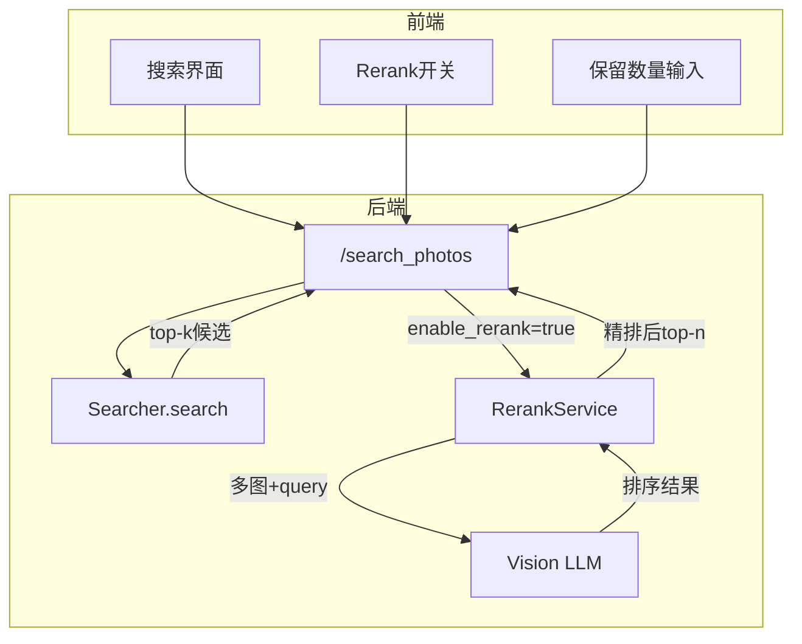

# Rerank功能开发方案

## 功能概述

在相似度检索返回top-k候选后，将这些图片送入Vision LLM进行二次精排（rerank），让LLM根据用户query选出最匹配的图片。

## 架构设计



## 涉及的文件和接口

### 1. 新增文件

- [utils/rerank_service.py](utils/rerank_service.py) - Rerank服务模块

### 2. 需修改的后端文件

| 文件 | 修改内容 |

|------|----------|

| [api/routes.py](api/routes.py) | `/search_photos`接口增加`enable_rerank`和`rerank_top_k`参数 |

| [config.py](config.py) | 添加Rerank相关配置项 |

| [main.py](main.py) | 初始化RerankService并注入routes |

### 3. 需修改的前端文件

| 文件 | 修改内容 |

|------|----------|

| [templates/index.html](templates/index.html) | 添加Rerank开关和保留数量控件 |

---

## 详细设计

### 一、RerankService（新建）

**文件路径**: `utils/rerank_service.py`

**核心逻辑**:

```python
class RerankService:
    def __init__(self, vision_llm: VisionLLMService, ...):
        self.vision_llm = vision_llm
    
    def rerank(
        self, 
        query: str, 
        candidates: List[Dict], 
        rerank_top_k: int
    ) -> List[Dict]:
        """
        对候选图片进行Vision LLM重排序
        
        1. 读取并优化每张候选图片（Base64编码）
        2. 构建多图prompt，让LLM根据query排序
        3. 解析LLM返回的排序结果
        4. 返回重排后的top-n结果
        """
```

**Prompt设计**:

- 输入：用户query + 多张图片（编号1, 2, 3...）
- 输出：按相关性排序的图片编号列表
- 示例prompt：
  ```
  用户正在搜索："{query}"
  
  以下是候选图片（编号1-N），请根据与用户搜索意图的匹配程度，
  从最相关到最不相关排序，返回图片编号列表。
  
  只返回JSON格式：{"ranking": [3, 1, 5, 2, 4]}
  ```


### 二、API接口修改

**修改文件**: [api/routes.py](api/routes.py)

**`/search_photos` 接口参数扩展**:

```python
# 请求体扩展
{
    "query": str,           # 原有
    "top_k": int,           # 原有
    "enable_rerank": bool,  # 新增：是否启用rerank
    "rerank_top_k": int     # 新增：rerank后保留数量
}

# 响应体扩展
{
    "status": "success",
    "results": [...],
    "total_results": int,
    "elapsed_time": float,
    "reranked": bool        # 新增：是否经过rerank
}
```

**处理流程**:

```python
# 1. 执行原有搜索
results = searcher.search(query, top_k)

# 2. 如果启用rerank且有结果
if enable_rerank and results:
    rerank_top_k = min(rerank_top_k, len(results))
    results = rerank_service.rerank(query, results, rerank_top_k)
    reranked = True
```

### 三、配置项添加

**修改文件**: [config.py](config.py)

```python
# Rerank 配置
"RERANK_ENABLED": os.getenv("RERANK_ENABLED", "true").lower() == "true",
"RERANK_MODEL_NAME": os.getenv("RERANK_MODEL_NAME", config["VISION_MODEL_NAME"]),
"RERANK_IMAGE_MAX_SIZE": _get_int("RERANK_IMAGE_MAX_SIZE", 512),  # 更小尺寸降低成本
"RERANK_IMAGE_QUALITY": _get_int("RERANK_IMAGE_QUALITY", 75),
"RERANK_MAX_IMAGES": _get_int("RERANK_MAX_IMAGES", 10),  # 最多送几张图给LLM
"RERANK_TIMEOUT": _get_int("RERANK_TIMEOUT", 60),  # 多图需要更长超时
```

### 四、前端UI修改

**修改文件**: [templates/index.html](templates/index.html)

**新增控件**（在搜索输入框区域）:

```html
<!-- Rerank控制区 -->
<div class="rerank-wrapper">
    <label class="rerank-toggle">
        <input type="checkbox" id="rerank-checkbox">
        <span>启用精排</span>
    </label>
    <div class="rerank-topk" id="rerank-topk-wrapper" style="display:none;">
        <label>保留数量</label>
        <input type="number" id="rerank-topk" value="5" min="1" max="10">
    </div>
</div>
```

**搜索请求修改**:

```javascript
body: JSON.stringify({
    query: query,
    top_k: topK,
    enable_rerank: document.getElementById('rerank-checkbox').checked,
    rerank_top_k: parseInt(document.getElementById('rerank-topk').value) || 5
})
```

---

## 成本优化策略

1. **图片压缩**: Rerank时使用更小的图片尺寸（512px vs 索引时1024px）
2. **数量限制**: 最多送10张图片给LLM（可配置）
3. **格式优化**: 使用WEBP格式降低Base64大小
4. **按需启用**: 用户可自由开关，不强制使用

---

## 错误处理

1. **LLM调用失败**: 降级返回原始相似度排序结果
2. **解析失败**: 如果无法解析LLM返回的排序，返回原始结果
3. **超时处理**: 设置较长超时（60s），超时后降级

---

## 测试要点

1. Rerank开关关闭时，行为与原有一致
2. Rerank开启后，返回结果数量正确
3. LLM返回异常时的降级处理
4. 前端控件状态联动（开关控制数量输入框显隐）