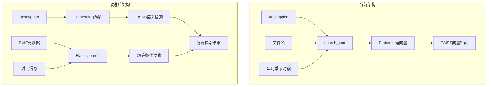

# 照片搜索引擎架构重构方案

## 问题分析

当前架构存在的问题：

- **Embedding混杂**：`search_text` 将 description + 文件名 + 年月 + 季节 + 时段 混合后生成embedding，导致语义向量被稀释
- **时间信息污染向量空间**：时间词汇会干扰图片内容的语义匹配
- **时段划分过粗**：仅3个时段（白天/傍晚/夜晚），无法满足精细查询需求

## 架构改进目标



## 修改内容

### 1. 修改 `core/indexer.py`

**关键改动**：

- **`_build_search_text()` 简化**：只返回纯 description，不再拼接任何时间/文件名信息
```python
def _build_search_text(self, description: str, ...) -> str:
    # 仅返回description用于embedding
    if description and len(description) >= 20:
        return description.strip()
    return ""
```

- **新增 `_extract_time_info()` 方法**：提取详细时间信息（年/月/日/季节/时段/星期）
```python
def _extract_time_info(self, exif_data, file_time) -> Dict[str, Any]:
    # 返回 {year, month, day, season, time_period, weekday, hour}
```

- **时段细分为7档**：
  - 凌晨 (0:00-5:00)
  - 早晨 (5:00-8:00)
  - 上午 (8:00-12:00)
  - 中午 (12:00-14:00)
  - 下午 (14:00-17:00)
  - 傍晚 (17:00-19:00)
  - 夜晚 (19:00-24:00)

- **修改 `process_batch()` 中的 metadata 结构**：
```python
metadata = {
    "photo_path": item["photo_path"],
    "description": item["description"],
    "exif_data": item["exif_data"],
    "file_time": item["file_time"],
    "time_info": self._extract_time_info(exif_data, file_time),  # 新增
}
```

- **修改 KeywordStore 同步逻辑**：传递完整的EXIF字段

### 2. 修改 `utils/keyword_store.py`

**关键改动**：

- **更新 ES mapping**：添加EXIF独立字段
```python
mapping = {
    "mappings": {
        "properties": {
            "photo_path": {"type": "keyword"},
            "description": {"type": "text", "analyzer": "ik_max_word"},
            "file_name": {"type": "text"},
            # EXIF独立字段（新增）
            "year": {"type": "integer"},
            "month": {"type": "integer"},
            "day": {"type": "integer"},
            "season": {"type": "keyword"},
            "time_period": {"type": "keyword"},
            "camera": {"type": "keyword"},
            "datetime": {"type": "date", "format": "strict_date_optional_time||epoch_millis"},
        }
    }
}
```

- **新增 `search_with_filters()` 方法**：支持 EXIF 条件精确过滤
```python
def search_with_filters(
    self,
    query: str,
    filters: Dict[str, Any],  # {year: 2024, season: "冬天", time_period: "上午"}
    top_k: int = 50,
) -> List[Dict[str, Any]]:
    # 构建 bool query 结合 must(文本) + filter(EXIF条件)
```


### 3. 修改 `core/searcher.py`

**关键改动**：

- **修改 `_hybrid_search()` 方法**：使用新的ES过滤接口
```python
def _hybrid_search(self, query, query_embedding, candidate_k, filters=None):
    # 1. 向量检索（纯语义匹配）
    vector_results = self.vector_store.search(query_embedding, candidate_k)
    
    # 2. 关键字检索 + EXIF过滤
    if self.keyword_store and filters:
        keyword_results = self.keyword_store.search_with_filters(query, filters, candidate_k)
    else:
        keyword_results = self.keyword_store.search(query, candidate_k) if self.keyword_store else []
    
    # 3. 融合排序...
```

- **修改 `_extract_time_constraints()` 方法**：返回结构化的过滤条件
```python
def _extract_time_constraints(self, query) -> Dict[str, Any]:
    # 返回 {year, month, season, time_period, start_date, end_date}
```

- **修改 `search()` 方法**：将时间约束转换为 ES filters

### 4. 更新测试文件

需要更新以下测试文件：

- [tests/test_indexer.py](tests/test_indexer.py)：测试新的 `_build_search_text()` 和 `_extract_time_info()`
- [tests/test_searcher.py](tests/test_searcher.py)：测试新的混合检索逻辑
- [tests/test_keyword_store.py](tests/test_keyword_store.py)：测试新的 ES mapping 和过滤方法

### 5. 数据迁移

由于 metadata 结构变化，需要重新构建索引：

- 删除旧的 `data/metadata.json` 和 `data/photo_search.index`
- 清空 ES 索引
- 重新运行索引构建

## 文件修改清单

| 文件 | 修改内容 |

|------|----------|

| [core/indexer.py](core/indexer.py) | 简化 `_build_search_text()`，新增 `_extract_time_info()`，更新 metadata 结构 |

| [utils/keyword_store.py](utils/keyword_store.py) | 更新 ES mapping，新增 `search_with_filters()` |

| [core/searcher.py](core/searcher.py) | 修改 `_hybrid_search()`，使用 ES 过滤 |

| [tests/test_indexer.py](tests/test_indexer.py) | 添加新方法的单元测试 |

| [tests/test_searcher.py](tests/test_searcher.py) | 更新混合检索测试 |

| [tests/test_keyword_store.py](tests/test_keyword_store.py) | 添加过滤方法测试 |

## 时段细分对照表

| 时段名称 | 时间范围 | 典型场景 |

|----------|----------|----------|

| 凌晨 | 0:00 - 5:00 | 星空、夜景 |

| 早晨 | 5:00 - 8:00 | 日出、晨跑 |

| 上午 | 8:00 - 12:00 | 工作、户外活动 |

| 中午 | 12:00 - 14:00 | 午餐、烈日 |

| 下午 | 14:00 - 17:00 | 下午茶、游玩 |

| 傍晚 | 17:00 - 19:00 | 日落、晚霞 |

| 夜晚 | 19:00 - 24:00 | 夜景、聚餐 |