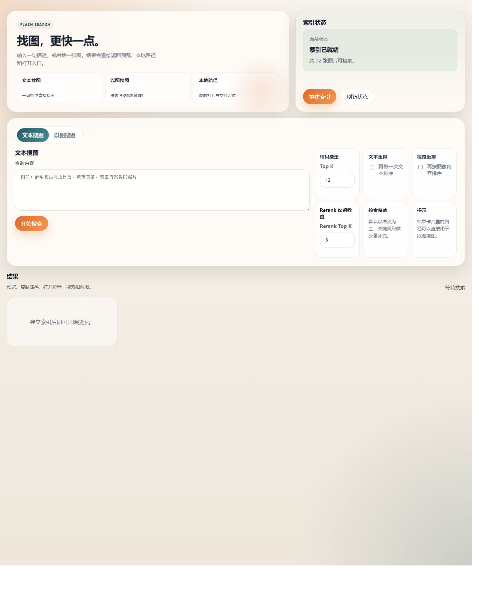
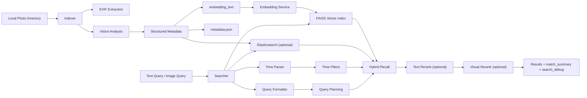

# Photo Search Engine

<p align="center">
  <strong>一个面向本地相册的 AI 照片搜索引擎</strong><br />
  用自然语言、参考图片或上传图片，在自己的照片库里快速找到真正想找的那一张。
</p>

<p align="center">
  
  
  
  
  
  
</p>

<p align="center">
  
</p>

<p align="center">
  Flask + FAISS + OpenAI 兼容模型接口 + 可选 Elasticsearch。<br />
  支持文本搜图、以图搜图、时间过滤、混合检索、双阶段重排，以及可解释的搜索结果。
</p>

<p align="center">
  <a href="#features">Features</a>
  ·
  <a href="#architecture">Architecture</a>
  ·
  <a href="#quick-start">Quick Start</a>
  ·
  <a href="#api-overview">API</a>
  ·
  <a href="#project-structure">Project Structure</a>
</p>

## Overview

当照片库规模变大以后，文件名、目录结构和人工翻找会很快失效。这个项目的目标不是做一个普通图库页，而是做一个真正能理解图片内容、理解检索意图、并能在本地图库里稳定召回结果的搜索系统。

它目前是一个本地优先的照片检索应用：

- 用自然语言搜索照片，例如“去年夏天傍晚在海边拍的照片”
- 用一张已入库图片查找视觉相似结果
- 上传一张临时图片做一次性相似搜索
- 结合时间语义、关键词与向量召回做混合检索
- 返回 `match_summary` 和 `search_debug`，解释系统为什么命中这张图
- 支持增量索引，适合日常持续向相册新增照片

> [!IMPORTANT]
> 这是一个本地优先项目。你可以按部署方式选择在线模型接口，或使用本地 Ollama 实现离线运行；无论哪种模式，索引文件、元数据和图片文件本身都保留在本地。

## Features

| Capability | Description |
| --- | --- |
| Structured image understanding | 不只生成一段 caption，而是提取 `outer_scene_summary`、`inner_content_summary`、`media_types`、`tags`、`ocr_text`、`identity_candidates`、`embedding_text`、`retrieval_text` |
| Text-to-image search | 直接用自然语言描述目标照片，支持长尾描述、场景描述、人物/媒介线索 |
| Image-to-image search | 支持使用已入库图片路径检索相似图片 |
| Upload-to-search | 支持上传一张临时图片进行一次性检索，不写入索引 |
| Time-aware filtering | 支持“去年”“夏天”“傍晚”等自然语言时间约束，时间标签基于 EXIF 拍摄时间 |
| Hybrid retrieval | FAISS 向量召回 + Elasticsearch 关键词检索融合；未启用 Elasticsearch 时自动降级为纯向量检索 |
| Query planning | 包含基础意图、保守扩展、单轮反思式调整，尽量兼顾召回与精度 |
| Two-stage rerank | 可选文本 rerank 与视觉 rerank，提升前排结果质量 |
| Explainable results | 返回 `match_summary` 和 `search_debug`，方便前端解释命中原因与检索规划 |
| Incremental indexing | 默认支持增量索引，新增照片后无需每次全量重建 |

## Use Cases

你可以用它处理这类检索任务：

- `去年夏天傍晚在海边拍的照片`
- `有明显海报文字的图片`
- `像截图一样的照片`
- `某位公众人物出镜的图片`
- `帮我找和这张图风格最接近的照片`

## Architecture



### Retrieval Pipeline

1. 索引阶段扫描本地图片目录，读取 EXIF，并生成结构化图像分析。
2. 系统会构建两套索引文本：更偏视觉语义的 `embedding_text` 用于生成向量写入 FAISS，保留 OCR 与身份词的 `retrieval_text` 用于关键词检索。
3. 如果启用了 Elasticsearch，会同步写入结构化字段与 `retrieval_text` 用于关键词与过滤检索。
4. 查询阶段会解析时间语义，并在必要时执行保守的查询扩展与单轮反思。
5. 基础召回结果会做融合和重排，避免缺失某一路信号时被无端压分。
6. 最终结果可选经过文本 rerank 与视觉 rerank，再返回给前端展示。

## Search Modes

| Mode | Input | Typical endpoint | Notes |
| --- | --- | --- | --- |
| Text search | 自然语言查询 | `POST /search_photos` | 支持时间语义、查询扩展、rerank |
| Image search by path | 本地绝对路径 | `POST /search_by_image` | 用已入库图片做相似搜索 |
| Uploaded image search | `multipart/form-data` 图片文件 | `POST /search_by_uploaded_image` | 临时图片搜索，不写入索引 |

## Quick Start

### 1. Requirements

- Python `3.12+`
- `uv`
- 可用的在线模型 API Key，或本地 Ollama
- 可选的 Elasticsearch 实例
- 支持的图片格式：`.jpg`、`.jpeg`、`.png`、`.webp`

### 2. Create The Environment

```bash
uv venv .venv --python 3.12
uv pip install --python .venv/bin/python -r requirements.txt
```

### 3. Configure `.env`

仓库现在提供三套环境模板：

- `.env.example`：Online 版本，默认使用在线 GPT 类模型
- `.env.country`：Kimi 版本，把 GPT 类聊天/视觉模型替换为 Kimi
- `.env.offline`：Offline 版本，全部切到本地 Ollama

任选一份复制为 `.env`，至少补齐以下变量：

| Variable | Required | Default | Purpose |
| --- | --- | --- | --- |
| `PHOTO_DIR` | Yes | None | 本地照片目录绝对路径，支持 Windows 路径或 WSL 路径 |
| `LLM_API_KEY` or `SU8_API_KEY` | Online / Kimi 必填，Ollama 可空 | None | Vision、时间解析、QueryFormatter、视觉 rerank 默认复用 |
| `LLM_BASE_URL` or `SU8_BASE_URL` | No | `https://www.su8.codes/codex/v1` | 通用聊天/视觉模型入口 |
| `EMBEDDING_API_KEY` | Online / Kimi 通常必填，Ollama 可空 | None | 文本和图片检索 embedding |
| `EMBEDDING_BASE_URL` | No | `https://router.tumuer.me/v1` | embedding 服务入口；Offline 模式应改为 `http://localhost:11434` |
| `ELASTICSEARCH_HOST` | No | `localhost` | 关键词检索与过滤增强；设为空可禁用 |
| `SERVER_PORT` | No | `10001` | 本地 Web 服务端口 |

最小可运行配置示例：

在线 GPT 版本：

```bash
PHOTO_DIR=/absolute/path/to/your/photos
LLM_API_KEY=sk-your-online-key
LLM_BASE_URL=https://www.su8.codes/codex/v1
EMBEDDING_API_KEY=sk-your-key
ELASTICSEARCH_HOST=
```

本地 Ollama 版本：

```bash
PHOTO_DIR=/absolute/path/to/your/photos
LLM_BASE_URL=http://localhost:11434
VISION_MODEL=qwen2.5vl:7b
EMBEDDING_BASE_URL=http://localhost:11434
EMBEDDING_MODEL=nomic-embed-text
TEXT_RERANK_BASE_URL=http://localhost:11434
TEXT_RERANK_MODEL=qwen2.5:7b-instruct
TEXT_RERANK_BACKEND=chat
ELASTICSEARCH_HOST=
```

<details>
<summary>查看推荐默认配置</summary>

```bash
VISION_MODEL=gpt-5.4
STRUCTURED_ANALYSIS_ENABLED=true
ENHANCED_ANALYSIS_ENABLED=true
TIME_PARSE_MODEL=gpt-5.1
QUERY_FORMAT_ENABLED=true
QUERY_EXPANSION_ENABLED=true
EMBEDDING_MODEL=Qwen/Qwen3-Embedding-8B
TEXT_RERANK_MODEL=Qwen/Qwen3-Reranker-8B
TEXT_RERANK_BACKEND=api
VISUAL_RERANK_ENABLED=true
VECTOR_METRIC=cosine
VECTOR_WEIGHT=0.85
KEYWORD_WEIGHT=0.15
```

</details>

### 4. Start The App

```bash
./.venv/bin/python main.py
```

默认访问地址：

```text
http://127.0.0.1:10001/
```

如果端口已被占用：

```bash
SERVER_PORT=10002 ./.venv/bin/python main.py
```

### 5. Build The Index

服务启动后，可以在首页直接点击：

- `增量索引`：日常新增照片后补齐索引
- `全量重建`：模型、索引结构或 mapping 变化后重建全部索引

也可以直接调用 HTTP 接口：

```bash
curl -X POST http://127.0.0.1:10001/init_index \
  -H 'Content-Type: application/json' \
  -d '{"mode":"incremental"}'
```

```bash
curl -X POST http://127.0.0.1:10001/init_index \
  -H 'Content-Type: application/json' \
  -d '{"mode":"full"}'
```

## What Gets Stored

索引构建后，本地会生成这些核心文件：

| File | Purpose |
| --- | --- |
| `data/photo_search.index` | FAISS 向量索引 |
| `data/metadata.json` | 结构化元数据与检索字段 |
| `data/index_status.status` | 当前索引状态 |
| `data/index_ready.marker` | 索引可用标记 |
| `data/index_timing.jsonl` | 索引构建耗时日志 |

如果启用了 Elasticsearch，还会额外建立关键词索引文档。

## API Overview

| Endpoint | Method | Description |
| --- | --- | --- |
| `/` | `GET` | 首页，服务端渲染的单页前端 |
| `/init_index` | `POST` | 启动增量索引或全量重建 |
| `/index_status` | `GET` | 获取当前索引状态 |
| `/search_photos` | `POST` | 文本搜图 |
| `/search_by_image` | `POST` | 使用已入库图片路径进行相似检索 |
| `/search_by_uploaded_image` | `POST` | 上传图片进行临时检索 |
| `/open_photo_location` | `POST` | 在本地文件管理器中打开图片所在位置 |
| `/photo?path=...` | `GET` | 预览图片，供前端结果卡片展示 |

<details>
<summary>查看请求示例</summary>

`POST /search_photos`

```json
{
  "query": "去年夏天傍晚在海边拍的照片",
  "top_k": 12,
  "rerank_top_k": 12,
  "enable_text_rerank": true,
  "enable_visual_rerank": true
}
```

`POST /search_by_image`

```json
{
  "image_path": "C:/Users/you/Pictures/example.jpg",
  "top_k": 12,
  "query_hint": "偏暖色的人像",
  "enable_visual_rerank": true
}
```

`POST /search_by_uploaded_image`

使用 `multipart/form-data` 发送以下字段：

- `image`
- `top_k`
- `rerank_top_k`
- `enable_text_rerank`
- `enable_visual_rerank`
- `query_hint`

</details>

## Result Shape

搜索结果中的每条记录通常包含这些字段：

```json
{
  "photo_path": "C:/Users/you/Pictures/example.jpg",
  "photo_url": "/photo?path=C%3A%2FUsers%2Fyou%2FPictures%2Fexample.jpg",
  "file_name": "example.jpg",
  "score": 0.9134,
  "rank": 1,
  "match_summary": {
    "media_types": ["photo"],
    "top_tags": ["beach", "sunset"],
    "identities": [],
    "identity_evidence": [],
    "ocr_excerpt": ""
  }
}
```

整个搜索响应还会附带：

- `search_debug`：记录基础意图、扩展轮次、反思轮次、各轮结果数量和分数
- `text_reranked`：文本 rerank 是否实际执行
- `visual_reranked`：视觉 rerank 是否实际执行
- `elapsed_time`：请求耗时

## Indexing Strategy

当前版本已经支持增量索引。大多数日常使用场景不需要全量重建。

| Scenario | Recommended mode |
| --- | --- |
| 新增了一批照片 | `incremental` |
| 切换了 embedding 模型 | `full` |
| 修改了 `retrieval_text` 生成逻辑 | `full` |
| 修改了结构化分析字段 | `full` |
| 修改了 Elasticsearch mapping | `full` |
| 旧索引损坏或维度不兼容 | `full` |

## Time Metadata Rules

时间过滤依赖 EXIF 中的拍摄时间，而不是文件修改时间。这是为了避免没有 EXIF 的图片被错误打上时间标签。

这意味着：

- 没有 EXIF `datetime` 的图片仍然可以参与普通检索和以图搜图
- 但它们不会被“去年”“夏天”“傍晚”这类时间过滤查询误命中

## Native Launchers

仓库现在提供两套互不跨系统的启动脚本：

- Windows 原生版：只使用 PowerShell 和 Windows Python，不调用 `wsl.exe`
- WSL 原生版：只使用 Bash 和 WSL Python，不调用 PowerShell

### Native Windows

如果你希望完全避开 WSL，并且把索引、`metadata.json`、状态文件都固定写到项目根目录下的 `data/`，可以直接使用：

```bat
start_windows.bat
```

或：

```powershell
powershell.exe -NoProfile -ExecutionPolicy Bypass -File "C:\Users\86159\Desktop\Photo_Search_Engine\artifacts\start_windows.ps1"
```

这个脚本会自动：

- 在 PowerShell 下安装 `uv`（如果系统里还没有）
- 创建独立的 Windows 虚拟环境 `.venv-windows/`
- 安装或更新 `requirements.txt`
- 读取 `.env` 中的 `PHOTO_DIR`，并在遇到 `/mnt/c/...` 时自动转成 Windows 路径
- 强制把 `DATA_DIR`、`RUNTIME_DATA_DIR`、`INDEX_PATH`、`METADATA_PATH` 都固定到当前项目根目录下的 `data/`

如果要换端口：

```powershell
powershell.exe -NoProfile -ExecutionPolicy Bypass -File ".\artifacts\start_windows.ps1" -Port 10002
```

### Native WSL

如果你希望整个流程都在 WSL 内完成，可以直接使用：

```bash
bash ./artifacts/start_wsl.sh
```

或者继续沿用兼容入口：

```bash
bash ./artifacts/start_stack.sh
```

这个脚本会自动：

- 在 WSL 下安装 `uv`（如果系统里还没有）
- 创建 WSL 虚拟环境 `.venv/`
- 安装或更新 `requirements.txt`
- 读取 `.env` 中的 `PHOTO_DIR`，并在遇到 `C:\...` 时自动转成 `/mnt/c/...`
- 强制把 `DATA_DIR`、`RUNTIME_DATA_DIR`、`INDEX_PATH`、`METADATA_PATH` 都固定到当前项目根目录下的 `data/`

如果要换端口：

```bash
bash ./artifacts/start_wsl.sh 10002
```

不管是 Windows 版还是 WSL 版，最终都会把以下文件写到当前项目目录中：

- `data/photo_search.index`
- `data/metadata.json`
- `data/index_status.status`
- `data/index_ready.marker`
- `data/index_timing.jsonl`

## Project Structure

```text
api/                 Flask 路由与 HTTP 接口
core/                索引与检索核心逻辑
utils/               模型服务、时间解析、路径处理、向量存储等
templates/           服务端渲染单页前端
tests/               pytest 测试与 fake helpers
artifacts/           截图、辅助脚本、运行脚本
data/                本地索引、状态文件与元数据
config.py            环境变量配置加载
main.py              应用入口
README.md            项目说明
```

## Development

使用 `uv` 作为标准开发工作流。

运行完整测试：

```bash
./.venv/bin/python -m pytest -q
```

运行单个测试文件：

```bash
./.venv/bin/python -m pytest tests/test_routes.py -q
./.venv/bin/python -m pytest tests/test_searcher.py -q
./.venv/bin/python -m pytest tests/test_indexer.py -q
```

测试默认使用轻量 fake service，不会消耗真实线上额度。

## Notes

- 前端目前是一个服务端渲染单页，适合快速本地使用，也方便后续继续演进 UI。
- `QUERY_FORMAT_API_KEY` 默认复用 `LLM_API_KEY`，同时兼容旧变量 `SU8_API_KEY`。
- `TEXT_RERANK_API_KEY` 默认复用 `EMBEDDING_API_KEY`。
- `TEXT_RERANK_BACKEND=api` 适合当前在线专有 rerank 接口；`TEXT_RERANK_BACKEND=chat` 适合 Kimi 和 Ollama。
- 本地 Ollama 可直接填写 `http://localhost:11434`，代码会自动补到 OpenAI 兼容的 `/v1`，也允许本地无真实 API key。
- Elasticsearch 是可选增强能力，不可用时系统仍可退化运行。
- `/photo` 预览接口要求绝对路径，且当前仅支持 `.jpg`、`.jpeg`、`.png`、`.webp`。

## Roadmap

- [ ] 更强的筛选能力与结果面板对比
- [ ] 更稳定的人物识别与身份证据策略
- [ ] 更细的结果解释和调试信息展示
- [ ] 更完整的部署、数据管理与运维脚本
- [ ] 更丰富的前端交互与结果浏览体验

## Contributing

欢迎继续基于当前结构扩展这个项目。提交 PR 时，建议同时说明：

- 改动了哪些检索逻辑或配置变量
- 是否需要重新构建索引
- 跑了哪些测试
- 如果涉及 UI，附上截图

在修改检索逻辑时，优先补充对应的 route 测试和底层单元测试。
